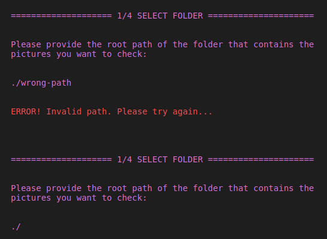
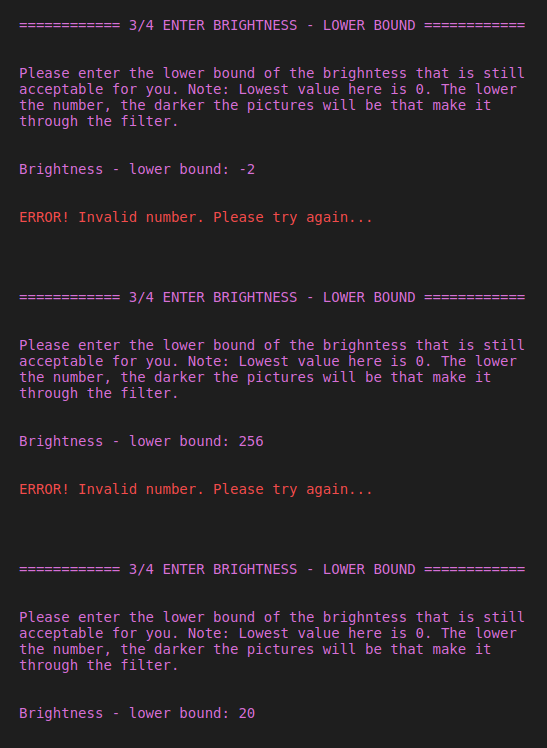
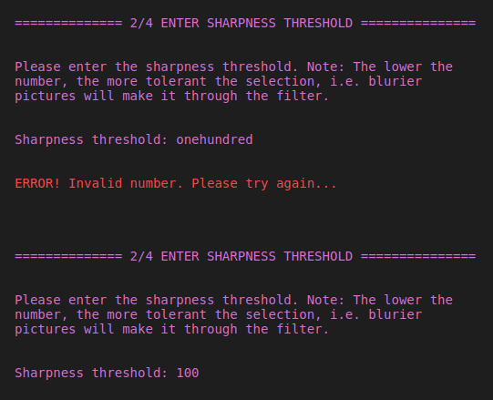

# IMAGE-DELETE CLI
The Image-Delete-CLI checks brightness and sharpness of images in a designated folder and gets rid of the ones that don't fall within an acceptable range of the provided parameters.

My focus for this assignment was to create a useful, robust tool with pleasant user experience, graceful error handling, written in a way that is easy to share and maintain.

[Screenshot - Happy Flow](./screenshots/hapy_flow.png)
You can find the video for this assignment [HERE](https://youtu.be/DLuNhrOeyRk)

## Design
This program is written in Python3 using a number of third party libraries for image evaluation, file-system operations and output formatting.

### Requirements
* opencv-python (cv2)
* numpy
* imutils
* send2trash

## Usage
`$ python image_delete.py`

After executing this command, the user will be prompted to input the required information and confirm deleting unwanted files. This CLI takes in the following input from the user:
* path where images are stored,
* upper and lower bounds for acceptable brightness and
* sharpness thresholds

Using these parameters the CLI recursively looks for images in the provided folder and deletes the ones that aren't good enough.

Error handling and validations for the following scenarios are included. If any of these validations are triggered the user will be prompted to re-enter the requested value until the desired input has been provided.

> invalid path

> out of bounds values for brightness

> type validations for brightness and sharpness thresholds

